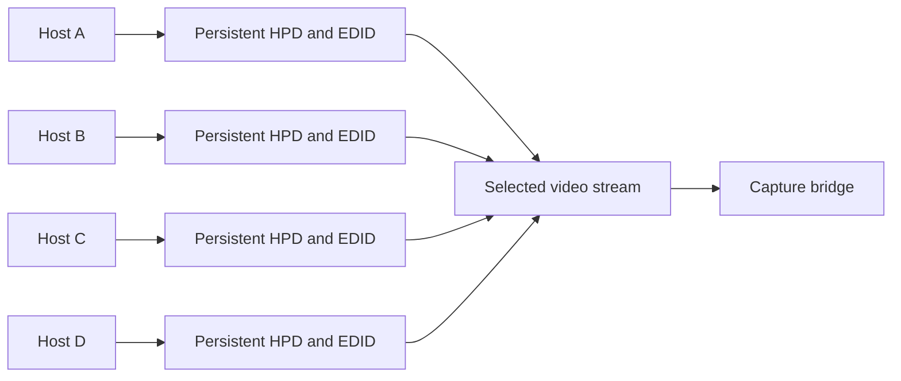

# Desired behavior and remaining work

Each connected input should continuously present a monitor:

- HPD remains asserted independent of selected capture input.
- Each source's DDC interface serves the same configured, stable EDID.
- A fixed profile can prefer 1920×1080 at 60 Hz.
- Changing selection changes capture and keyboard/mouse routing without
  monitor removal, EDID mutation, or display rearrangement on other hosts.

The KVM does not need four simultaneous capture engines. It needs persistent
source-facing monitor emulation while routing one stream to capture.

This diagram is the desired architecture, not a claim that all four input
DDC interfaces have already been validated.

## Next validation

1. Capture video from a second connected source while the first source keeps
   its monitor. Account for MCU receiver initialization and routing objects.
2. Test longer holds, repeated selection, boot/wake on inactive sources, and
   capture-service restarts. Measure switching latency after correctness.
3. Verify fresh EDID reads on every source-facing DDC interface. Validate the
   SDK's bank-assignment sequence, checksums, fixed identity, and ready-before-
   HPD ordering. Do not infer 2677's command semantics from its zero readback.
4. Integrate explicit capture/USB selection and accurate UI state. The normal
   channel API currently couples GPIO selection to the HPD-clearing command;
   a Linux service may need a small kernel interface change.
5. Make all UI/API/physical switching paths preserve the same invariant, and
   persist the configuration across reboot.

Acceptance requires all four attached hosts retaining byte-identical EDID
and no selection-induced HPD-low pulse, verified electrically and through
OS logs, while selected-source capture and USB both work. A background loop
that repairs HPD after it drops does not meet the requirement.

No complete fixed-EDID register recipe or flashable firmware is provided.
Runtime configuration remains preferable to replacing the MCU firmware if
the required routing/DDC behavior can be established with the existing SDK.
